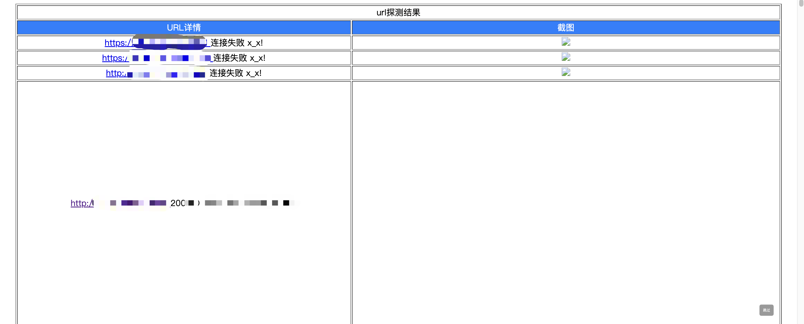
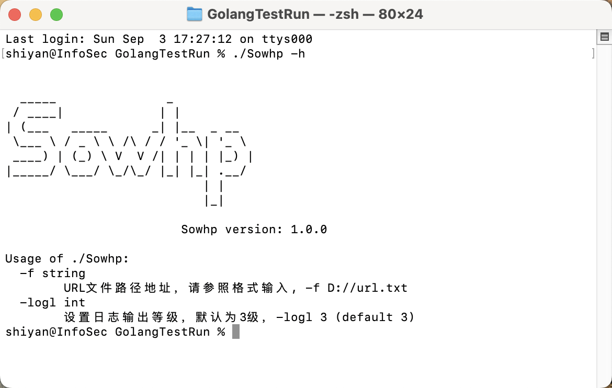
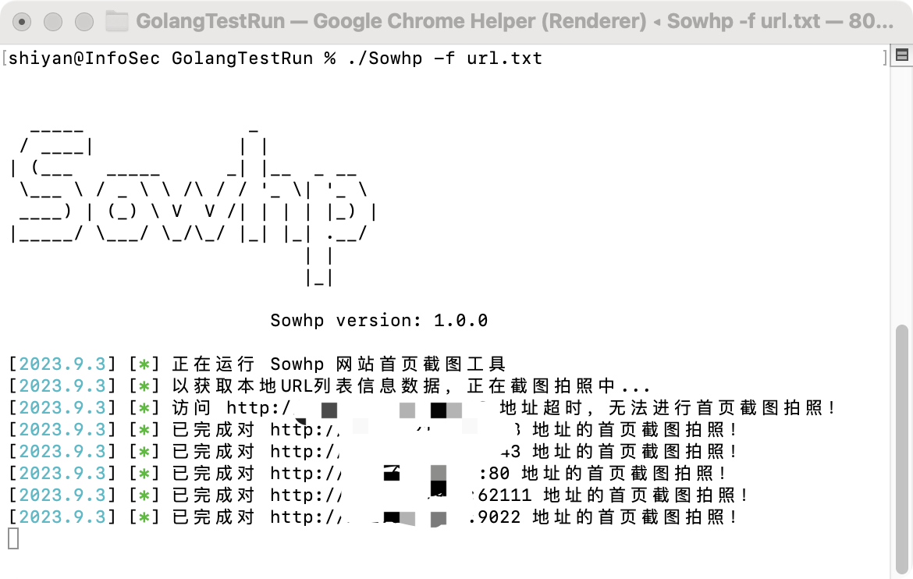
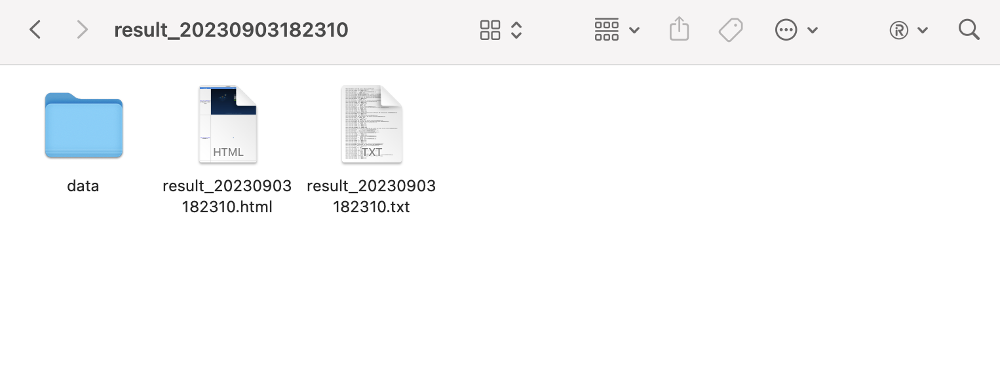
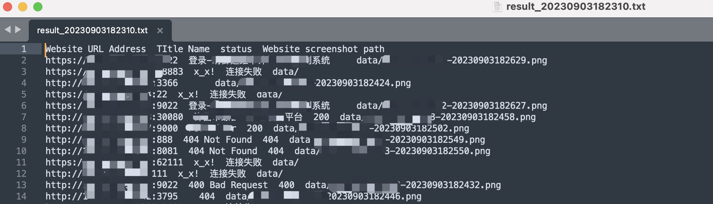
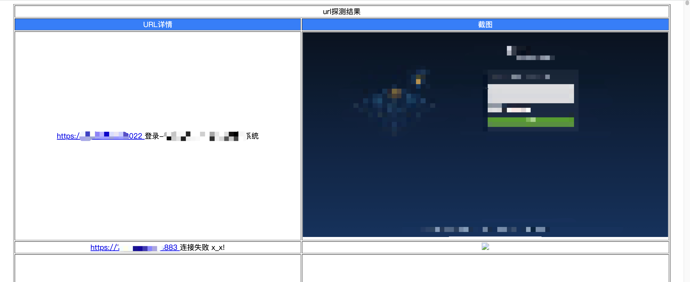

## Sowhp工具前言

本工具是[eyeurl](https://github.com/yunxiaoshu/eyeurl)的镜像工具，原工具为Python环境下编写，由于我本人最近升级了下吃饭的家伙，导致现有办公环境无法再正常运行该工具，故就自己写了一个golang版本的镜像工具。

### 工具说明

原版工具介绍：本款工具在渗透测试乃至攻防演练中可快速打点信息收集来的网页界面，对其网页界面进行截图，整理成报告形式，方便使用者快速判断并筛选出脆弱的网站，示例图：



除前言里说的原因外，由于我工作内容大头变更原因，需要对暴露面资产进行识别是否有目标客户相关logo等信息，基础采集的URL过多，不便于一个个打开查看，故在github上发现了[eyeurl](https://github.com/yunxiaoshu/eyeurl)工具，整体用下来还可以，速度也比较快，但毕竟换了电脑了，迁移过程就各种报错无法运行了，就想着用golang写一个一劳永逸的版本工具，避免环境变动导致各种无法运行的情况。

目前该工具对处理IP加端口形式的WEB资产识别还是比较准的，但是对域名形式的资产识别，还是有一些小误报的，我这里还需再研究研究杂克服这个问题。

### 使用说明

注：若笔记本环境是 MacBook m2 环境下的，可以直接使用我编译好的工具，如果不是的话，就需要手动进行编译了。 

1. 电脑里安装一下golang语言
2. 并在电脑中安装下谷歌浏览器
3. 打开本机电脑的命令行输入下列命令进行远程下载源码包：git clone https://github.com/sh1yan/Sowhp.git
4. 下载完成后，进入到该源码文件夹里：cd ./Sowhp
5. 使用下列命令进行源码编译：go build -ldflags="-s -w " -trimpath main.go
6. 若觉得编译后的可执行文件体积有点大，可以使用upx进行体积压缩：upx -9 Sowhp

上述整体编译完成后，即可执行下方命令进行查看说明

```shell
./Sowhp -h
```



### 示例

```
./Sowhp -f url.txt
```









大家在使用过程中遇到什么问题或者有什么建议的，欢迎大家提issues
